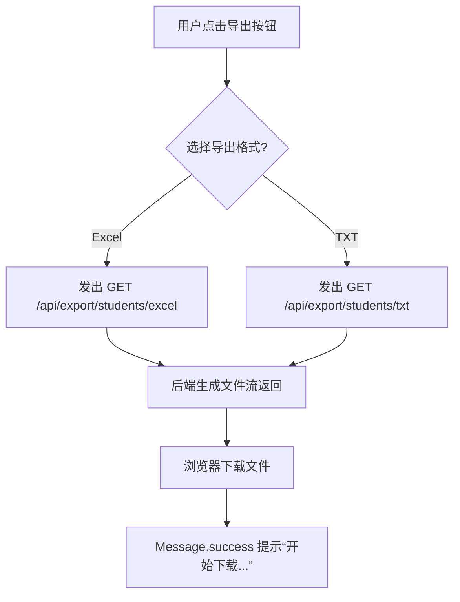

# 信息导出模块 API 说明

本模块用于前端展示学生信息列表，并提供导出为 **Excel** 与 **TXT** 文件的功能。

---

## 页面路径

`/info/export`

---

## 功能说明

### 1. 学生信息展示  
通过表格展示前端数据，当前实现为静态示例（后续与后端接口打通）。  
未来接口可由后端返回分页查询结果。

| 字段名 | 类型 | 说明 |
| ------- | ---- | ---- |
| id | number | 学生唯一标识 |
| name | string | 姓名 |
| studentId | string | 学号 |
| major | string | 专业 |
| class | string | 班级 |
| score | number | 加分项 |

---

### 2. 导出 Excel 文件

触发逻辑：用户点击 **“学生信息导出为 Excel”** 区域。  
前端调用下载接口生成可导出的 `.xls` / `.xlsx` 文件。

#### 接口定义

| 项目 | 内容 |
| ---- | ---- |
| **接口名称** | 导出学生信息（Excel） |
| **请求方法** | `GET` |
| **请求路径** | `/api/export/students/excel` |
| **请求参数** | 无（默认导出全部数据，也可携带 query 条件） |
| **返回类型** | `application/vnd.ms-excel` |
| **示例请求** | `/api/export/students/excel` |
| **前端绑定方法** | `handleDownloadExcel()` |

#### 返回示例

```
HTTP/1.1 200 OK
Content-Disposition: attachment; filename="students.xlsx"
Content-Type: application/vnd.ms-excel
```

---

### 3. 导出 TXT 文件

触发逻辑：用户点击 **“学生信息导出为 TXT”** 区域。  
前端调用下载接口生成 `.txt` 文件。

#### 接口定义

| 项目 | 内容 |
| ---- | ---- |
| **接口名称** | 导出学生信息（TXT） |
| **请求方法** | `GET` |
| **请求路径** | `/api/export/students/txt` |
| **请求参数** | 无 |
| **返回类型** | `text/plain` |
| **示例请求** | `/api/export/students/txt` |
| **前端绑定方法** | `handleDownloadTxt()` |

#### 返回示例

```
HTTP/1.1 200 OK
Content-Disposition: attachment; filename="students.txt"
Content-Type: text/plain; charset=utf-8
```

---

## 前端交互流程



---

## 接口设计规范补充

- 所有下载接口应设置 `Content-Disposition` 响应头以确保浏览器能正确识别文件名。
- 统一错误响应格式：
  ```json
  { "code": 400, "message": "导出失败，请稍后再试" }
  ```
- Excel / TXT 导出接口建议支持查询参数过滤（如班级、专业）。

---

## 实现状态

| 功能项 | 状态 | 备注 |
| ------- | ---- | ---- |
| 表格展示 | ✅ | 当前为静态数据示例 |
| Excel 导出 | 🚧 | 待接入后端文件流 |
| TXT 导出 | 🚧 | 待接入后端文件流 |
| 下载反馈提示 | ✅ | 前端已实现 Message.success 提示 |

---

**文件位置：** `src/views/info/export/index.vue`  
**文档文件：** `docs/api/info-export.md`
