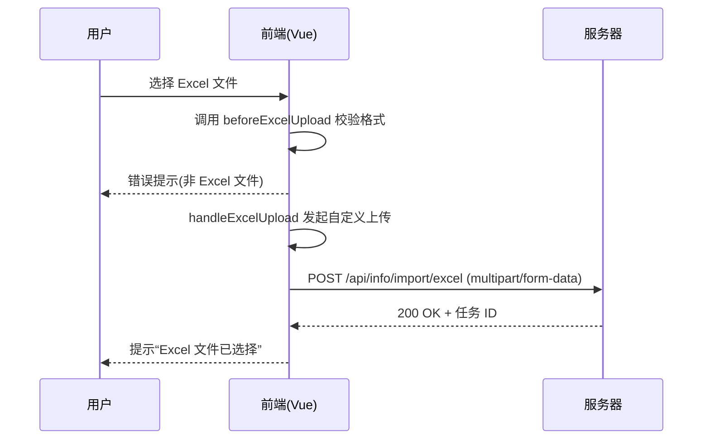
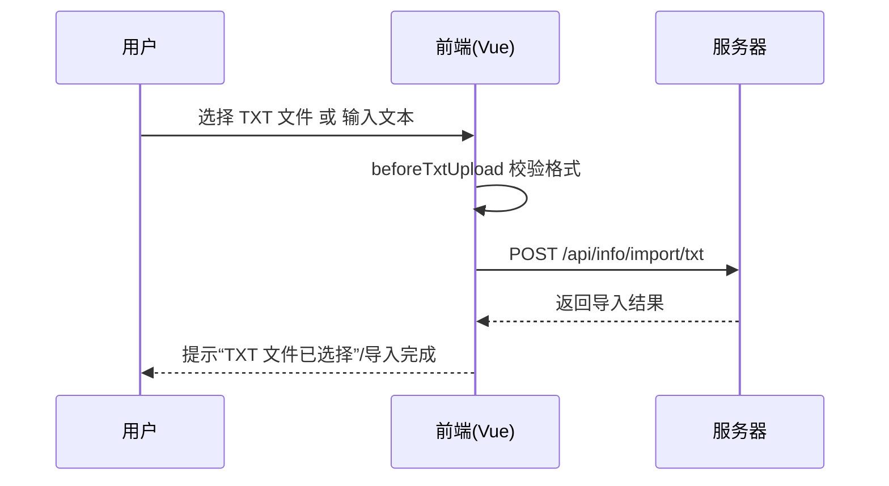

# 信息导入模块 API 文档

本文档描述了「信息导入」模块（`src/views/info/import/index.vue`）中涉及的前端交互逻辑、文件类型校验及上传流程对应的后端接口规范。

---

## 模块概述

该模块分为 **Excel 导入** 与 **文本导入** 两个部分，提供从文件或粘贴内容批量录入信息的能力。  
所有上传操作由前端校验文件类型后，通过自定义上传请求发送至后端。

---

## 一、Excel 导入

### 相关函数

| 函数名 | 作用 | 说明 |
|--------|------|------|
| `beforeExcelUpload(file)` | 上传前校验 | 校验文件扩展名是否为 `.xls` 或 `.xlsx` |
| `handleExcelUpload(options)` | 上传请求 | 接受 `UploadRequestOption` 对象，向后端提交 Excel 文件 |

### 接口定义

| 字段 | 内容 |
|------|------|
| **接口名称** | 上传学生信息 Excel 文件 |
| **请求路径** | `/api/info/import/excel` |
| **请求方法** | `POST` |
| **请求类型** | `multipart/form-data` |
| **请求参数** | 见下表 |

#### 请求参数

| 参数名 | 类型 | 必填 | 说明 |
|--------|------|------|------|
| `file` | File | 是 | 需上传的 Excel 文件 (.xls / .xlsx) |

#### 响应参数

| 字段 | 类型 | 说明 |
|------|------|------|
| `code` | number | 状态码，200 表示成功 |
| `message` | string | 上传结果信息 |
| `data` | object | 预解析结果或导入任务 ID |

#### 示例响应

```json
{
  "code": 200,
  "message": "Excel 文件已成功接收",
  "data": {
    "taskId": "import_20251103_001"
  }
}
```

#### 错误响应示例

```json
{
  "code": 400,
  "message": "文件格式错误，仅支持 .xls/.xlsx"
}
```

---

### 交互流程（Excel 上传）



---

## 二、文本导入

### 相关函数

| 函数名 | 作用 | 说明 |
|--------|------|------|
| `beforeTxtUpload(file)` | 上传前校验 | 校验文件扩展名是否为 `.txt` |
| `handleTxtUpload(options)` | 上传请求 | 自定义 TXT 文件上传逻辑 |
| `textContent (v-model)` | 输入内容 | 绑定文本域内容并提交（可选实现） |

### 接口定义

| 字段 | 内容 |
|------|------|
| **接口名称** | 上传 TXT 文本信息文件 |
| **请求路径** | `/api/info/import/txt` |
| **请求方法** | `POST` |
| **请求类型** | `multipart/form-data` |
| **请求参数** | 见下表 |

#### 请求参数

| 参数名 | 类型 | 必填 | 说明 |
|--------|------|------|------|
| `file` | File | 是 | 上传的 TXT 文件 |
| `text` | string | 否 | 直接输入的文本内容（若无文件上传） |

#### 响应参数

| 字段 | 类型 | 说明 |
|------|------|------|
| `code` | number | 状态码 |
| `message` | string | 上传结果 |
| `data` | object | 导入结果或错误详情 |

#### 示例响应

```json
{
  "code": 200,
  "message": "导入成功",
  "data": {
    "lines": 123,
    "errors": []
  }
}
```

#### 错误响应示例

```json
{
  "code": 400,
  "message": "TXT 文件格式错误或内容为空"
}
```

---

### 交互流程（文本上传）



---

## 三、前端交互要点

| 要点 | 描述 |
|------|------|
| 弹窗与消息 | 使用 `Message.success` 或 `Message.error` 提示用户操作状态 |
| 上传组件 | 均使用 `a-upload` 的 `custom-request` 自定义上传逻辑 |
| 文件校验 | `beforeUpload` 钩子在前端阻断非法文件 |
| 多类型导入 | 支持文件上传与直接文本输入两种方式 |

---

## 四、规范说明

所有导入类接口必须满足以下约定：

1. 请求体使用 `multipart/form-data`。
2. 接口返回必须包含 `code` 与 `message` 字段。
3. 文件类型限制需在前端校验与后端再次验证。
4. 大文件上传需支持断点或分片（未来版本中实现）。

---

📄 **文档文件路径：** `docs/api/info-import.md`

🌐 **关联前端文件：** `src/views/info/import/index.vue`
