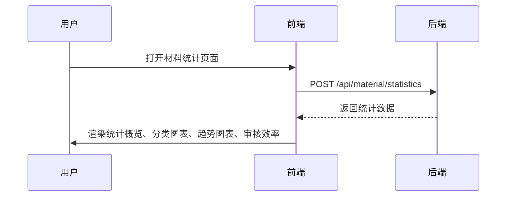

# 材料统计模块 API 文档

## 接口一览

| 接口名称 | 方法 | URL | 描述 |
| --- | --- | --- | --- |
| 获取材料统计 | POST | `/api/material/statistics` | 获取材料总数、各状态数量、分类统计等信息 |

---

## 接口详情

### 获取材料统计

- **URL**: `/api/material/statistics`
- **方法**: `POST`
- **请求参数**: 无
- **响应示例**:

```json
{
  "code": 0,
  "data": {
    "total": 120,
    "pending": 15,
    "approved": 90,
    "rejected": 15,
    "byCategory": {
      "document": 40,
      "image": 30,
      "video": 20,
      "audio": 15,
      "other": 15
    }
  },
  "message": "success"
}
```

- **响应参数说明**:

| 字段 | 类型 | 描述 |
| --- | --- | --- |
| total | number | 材料总数 |
| pending | number | 待审核数量 |
| approved | number | 已通过数量 |
| rejected | number | 已拒绝数量 |
| byCategory | object | 按分类统计的数量 |

---

## 错误码

| 错误码 | 描述 |
| --- | --- |
| 0 | 成功 |
| 1001 | 参数错误 |
| 2001 | 服务器内部错误 |

---

## 时序图



---

## 备注

- 此接口用于材料统计页面的概览、分类统计、趋势图表及审核效率展示。
- 数据由 Mock.js 模拟生成，实际环境需替换为真实后端接口。
- 生成时间: 2025-11-03 23:07:00
