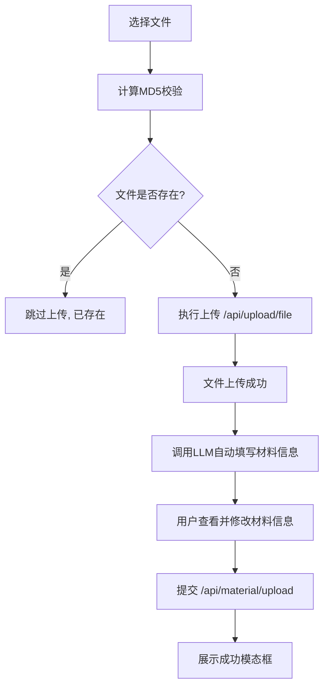

# 材料上传模块接口文档

## 模块简介
`src/views/material/upload/index.vue` 负责实现材料上传的前端功能，包括文件选择、校验、上传和材料信息提交。本模块支持文档、图片、视频、音频等多种格式，文件大小不得超过 10MB。

---

## 接口定义

| 接口名称 | 方法 | 路径 | 描述 |
|-----------|--------|----------------|----------------|
| 检查文件是否存在 | `POST` | `/api/upload/check` | 通过文件 MD5 校验是否已存在 |
| 上传文件 | `POST` | `/api/upload/file` | 上传文件到服务器并返回文件信息 |
| 调用LLM自动填写材料信息 | `POST` | `/api/material/llm-fill` | 根据已上传文件及元数据，调用LLM生成材料标题、描述、分类、标签等 |
| 提交材料信息 | `POST` | `/api/material/upload` | 提交已上传文件及材料元数据 |

---

### 4. 调用LLM自动填写材料信息 `/api/material/llm-fill`
```json
{
  "file_id": "uuid",
  "metadata": {
    "title": "",
    "description": "",
    "category": "",
    "tags": []
  }
}
```

**响应:**
```json
{
  "code": 200,
  "message": "LLM生成成功",
  "data": {
    "title": "项目申报材料（自动生成）",
    "description": "包含项目预算与团队信息，由LLM自动生成。",
    "category": "document",
    "tags": ["自动生成", "待确认"]
  }
}
```

---

## 请求参数

### 1. 检查文件是否存在 `/api/upload/check`
```json
{
  "md5": "string",
  "filename": "string"
}
```

**响应:**
```json
{
  "data": {
    "exists": true,
    "file_id": "string",
    "url": "string"
  }
}
```

---

### 2. 上传文件 `/api/upload/file`
**请求体（FormData）**
| 字段 | 类型 | 示例值 | 说明 |
|------|------|------|------|
| file | File | demo.pdf | 上传的文件 |

**响应:**
```json
{
  "data": {
    "file_id": "uuid",
    "url": "https://cdn.example.com/files/demo.pdf",
    "md5": "string"
  }
}
```

---

### 3. 提交材料信息 `/api/material/upload`
```json
{
  "title": "项目申报材料",
  "description": "包含项目预算与团队信息。",
  "category": "document",
  "tags": ["important", "urgent"],
  "files": ["b3c2d7f8a9", "c4a7b2e1da"]
}
```

**响应:**
```json
{
  "code": 200,
  "message": "材料上传成功",
  "data": {
    "material_id": "uuid",
    "uploaded_at": "2025-11-03T14:23:00Z"
  }
}
```

---

## 错误示例

| 状态码 | 说明 |
|---------|--------|
| 400 | 文件大小超过 10MB |
| 409 | 文件已存在 |
| 500 | 服务器错误 |

---

## 上传流程图



---

## 接口调用依赖关系
| 文件 | 引用函数 | 来源 |
|------|-----------|------|
| `uploadMaterial()` | 材料信息提交 | `@/api/material.ts` |
| `checkFileExists()` | 文件存在检查 | `@/api/upload.ts` |
| `uploadFile()` | 文件上传 | `@/api/upload.ts` |

---

## 最佳实践
- 在上传前应计算 MD5 防止重复上传。
- 上传文件后自动更新 `uploadedFiles` 列表。
- 上传完成后可调用 LLM 接口预填材料信息，减少用户手动输入。
- 用户应在提交前仔细检查并修改 LLM 生成的内容，确保准确性。
- 提交后重置表单并弹出成功模态框。

---
文档生成时间：2025-11-03T22:23:00+08:00
