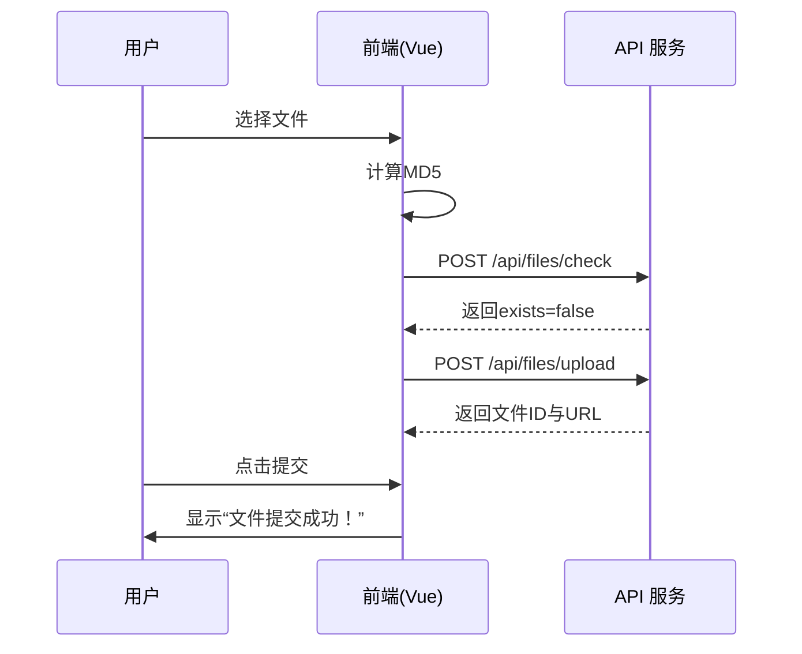

# 教务系统导入 API 文档

该文档描述了“教务系统导入”功能模块中前端页面（`src/views/user/import/jiaowu.vue`）所涉及的后端接口。主要功能包括文件上传前检查、文件上传与提交操作。

---

## 模块概述

“教务系统导入”模块提供了将教务相关数据文件批量上传至系统的能力。上传流程包括以下步骤：

1. 用户选择文件；
2. 前端计算文件 MD5；
3. 发送文件存在校验请求；
4. 若文件不存在则进行实际上传；
5. 上传完成后用户点击提交按钮（本页面仅提示成功，未调用后端任务提交接口）。

---

## 接口列表

| 接口名称         | 请求方法 | 请求路径               | 功能说明       |
| ---------------- | ---------- | ----------------------- | -------------- |
| 文件存在检查     | POST       | `/api/files/check`      | 检查文件是否存在（通过 MD5） |
| 文件上传         | POST       | `/api/files/upload`     | 上传文件内容 |

---

## 1. 文件存在检查

**接口地址**：`POST /api/files/check`  
**功能描述**：根据文件 MD5 值和文件名检查文件是否已经存在于系统中，避免重复上传。

### 请求参数

| 参数名     | 类型   | 是否必填 | 说明              |
|------------|--------|----------|-------------------|
| `md5`      | string | 是       | 文件的 MD5 值    |
| `filename` | string | 是       | 文件名称         |

### 返回示例

```json
{
  "code": 0,
  "data": {
    "exists": true,
    "file_id": "abc123",
    "url": "https://example.com/files/abc123"
  },
  "message": "success"
}
```

### 返回参数说明

| 字段名   | 类型   | 说明           |
|-----------|--------|----------------|
| `exists`  | boolean | 文件是否存在   |
| `file_id` | string  | 文件唯一 ID   |
| `url`     | string  | 文件访问地址   |

---

## 2. 文件上传

**接口地址**：`POST /api/files/upload`  
**功能描述**：上传文件内容。前端使用 FormData 方式提交。

### 请求头

`Content-Type: multipart/form-data`

### 请求体参数

| 参数名  | 类型  | 是否必填 | 说明 |
|----------|--------|----------|------|
| `file`  | file   | 是       | 上传的文件对象 |

### 响应示例

```json
{
  "code": 0,
  "data": {
    "file_id": "def456",
    "url": "https://example.com/files/def456"
  },
  "message": "upload success"
}
```

### 返回参数说明

| 字段名   | 类型   | 说明         |
|-----------|--------|--------------|
| `file_id` | string | 上传后生成的文件 ID |
| `url`     | string | 上传文件访问地址   |

---

## 3. 提交操作（前端逻辑）

**说明**：  
`handleSubmit()` 函数仅执行提示逻辑（如“文件提交成功！”），未实际调用后端任务提交接口。如需接入后端任务处理，可定义以下示例接口：

```http
POST /api/import/jiaowu/submit
```

**示例请求参数**
```json
{
  "files": [
    { "file_id": "xxx", "name": "成绩导入.xlsx" }
  ]
}
```

---

## 模块交互图



---

## 备注

当前模块的提交动作仍限于前端逻辑层，如后续需与后端导入任务系统结合，可在此基础上扩展“提交导入任务”接口。
