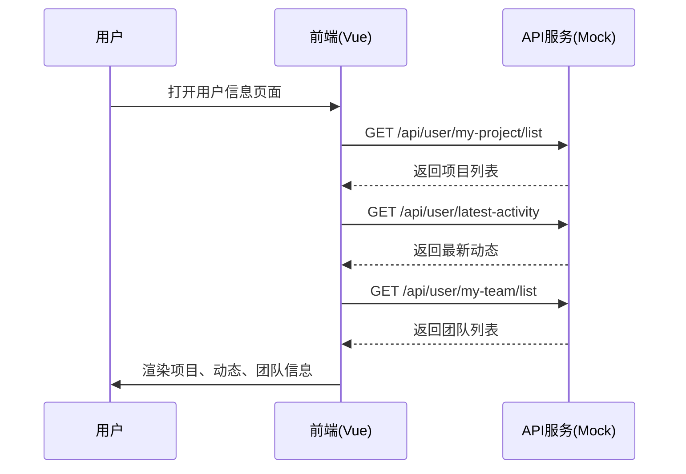

# 用户信息模块 API 文档

该文档描述 `/user/info` 模块所使用的 RESTful API 接口，包括请求方法、参数、响应示例、错误码及交互流程。

---

## 1. 获取我的项目列表

- **URL**: `/api/user/my-project/list`
- **方法**: `GET`
- **描述**: 获取当前用户参与的最新项目列表，包括项目名称、描述、参与人数及贡献者信息。

### 请求参数
无

### 响应参数
| 字段 | 类型 | 描述 |
| ---- | ---- | ---- |
| id | number | 项目 ID |
| name | string | 项目名称 |
| description | string | 项目描述 |
| peopleNumber | number | 参与人数 |
| contributors | array | 贡献者列表 |
| contributors[].name | string | 贡献者姓名 |
| contributors[].email | string | 贡献者邮箱 |
| contributors[].avatar | string | 贡献者头像 URL |

### 响应示例
```json
{
  "code": 0,
  "data": [
    {
      "id": 0,
      "name": "2025年xxx奖学金",
      "description": "Scholarship 1",
      "peopleNumber": 256,
      "contributors": [
        {
          "name": "张伟",
          "email": "zhangwei@example.com",
          "avatar": "//p1-arco.byteimg.com/tos-cn-i-uwbnlip3yd/a8c8cdb109cb051163646151a4a5083b.png"
        }
      ]
    }
  ]
}
```

---

## 2. 获取最新动态

- **URL**: `/api/user/latest-activity`
- **方法**: `GET`
- **描述**: 获取用户的最新活动记录。

### 请求参数
无

### 响应参数
| 字段 | 类型 | 描述 |
| ---- | ---- | ---- |
| id | number | 活动 ID |
| title | string | 活动标题 |
| description | string | 活动描述 |
| avatar | string | 活动相关头像 URL |

### 响应示例
```json
{
  "code": 0,
  "data": [
    {
      "id": 0,
      "title": "提交了材料",
      "description": "材料审核通过",
      "avatar": "//lf1-xgcdn-tos.pstatp.com/obj/vcloud/vadmin/start.png"
    }
  ]
}
```

---

## 3. 获取我的团队列表

- **URL**: `/api/user/my-team/list`
- **方法**: `GET`
- **描述**: 获取当前用户所属的团队列表。

### 请求参数
无

### 响应参数
| 字段 | 类型 | 描述 |
| ---- | ---- | ---- |
| id | number | 团队 ID |
| avatar | string | 团队头像 URL |
| name | string | 团队名称 |
| peopleNumber | number | 团队人数 |

### 响应示例
```json
{
  "code": 0,
  "data": [
    {
      "id": 1,
      "avatar": "",
      "name": "2024级信息学院",
      "peopleNumber": 120
    }
  ]
}
```

---

## 错误码

| 错误码 | 描述 |
| ------ | ---- |
| 0 | 成功 |
| 1001 | 未授权访问 |
| 1002 | 数据不存在 |
| 5000 | 服务器内部错误 |

---

## 模块交互流程

