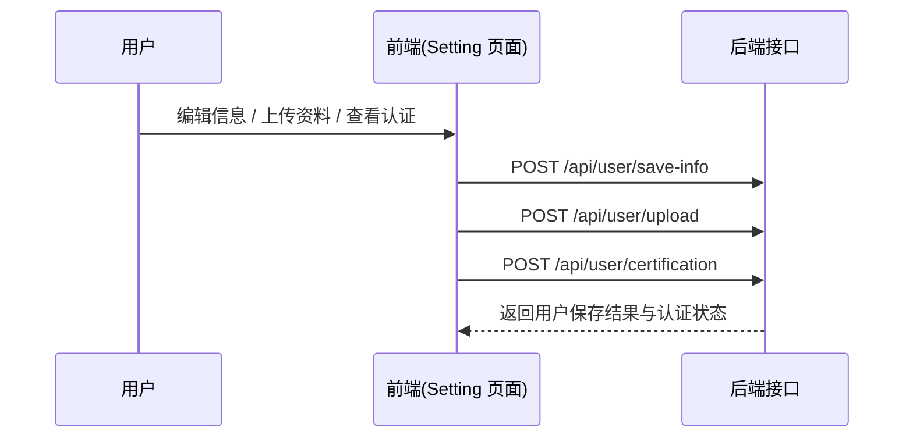

# 用户设置模块 API 文档

## 概述
该模块包含用户基本信息编辑、企业认证以及资料上传相关接口，文件位置：  
- `src/api/user.ts`  
- `src/api/user-center.ts`  
- `src/views/user/setting/mock.ts`  
对应页面：`src/views/user/setting/index.vue` 与子组件 `basic-information.vue`、`certification.vue`、`security-settings.vue`。

---

## 接口一览

| 接口名称 | 请求方法 | 接口地址 | 请求参数 | 响应示例 |
| -------- | -------- | -------- | -------- | -------- |
| 保存用户信息 | POST | `/api/user/save-info` | `SaveInfoData` | `"ok"` |
| 获取企业认证信息 | POST | `/api/user/certification` | 无 | 见下示例 |
| 上传认证资料 | POST | `/api/user/upload` | `FormData` | `"ok"` |

---

## 详细说明

### 1. 保存用户信息

**函数来源:** `saveUserInfo(data: SaveInfoData)`  
**文件:** `src/api/user.ts`

**请求方法:**  
`POST /api/user/save-info`

**请求参数:**
| 参数名 | 类型 | 说明 |
| ------- | ----- | ---- |
| name | string | 用户姓名 |
| email | string | 邮箱 |
| nickname | string | 昵称 |
| countryRegion | string | 国家/地区 |
| area | string | 所在区域 |
| address | string | 地址 |
| profile | string | 个人简介 |

**响应示例:**
```json
{
  "data": "ok",
  "message": "success"
}
```

---

### 2. 获取企业认证信息

**函数来源:** `queryCertification()`  
**文件:** `src/api/user-center.ts`

**请求方法**  
`POST /api/user/certification`

**响应模型:**
```json
{
  "enterpriseInfo": {
    "accountType": 1,
    "status": 1,
    "time": "2023-12-01",
    "legalPerson": "张三",
    "certificateType": "营业执照",
    "authenticationNumber": "A123456",
    "enterpriseName": "示例科技有限公司"
  },
  "record": [
    {
      "certificationType": 0,
      "certificationContent": "工商注册验证",
      "status": 1,
      "time": "2023-12-01"
    }
  ]
}
```

**字段说明:**
| 字段 | 类型 | 说明 |
| ---- | ---- | ---- |
| enterpriseInfo.accountType | number | 账户类型（个人/企业） |
| enterpriseInfo.status | number | 当前认证状态 |
| record.status | number | 每项认证进度状态 |
| record.time | string | 操作时间 |

---

### 3. 上传认证资料

**函数来源:** `userUploadApi(data: FormData, config)`  
**文件:** `src/api/user-center.ts`

**请求方法:**  
`POST /api/user/upload`

**请求参数:**
| 参数名 | 类型 | 说明 |
| ------- | ----- | ---- |
| data | FormData | 上传的表单数据（文件等） |
| controller | AbortController | 控制上传任务可取消 |
| onUploadProgress | function | 上传进度回调 |

**响应示例:**
```json
{
  "data": "ok",
  "message": "success"
}
```

---

## 错误码及说明

| 错误码 | 说明 |
| ------- | ---- |
| 400 | 参数错误或缺失（如必填字段为空或格式不正确） |
| 403 | 权限不足或认证失败（如未通过企业认证或无访问权限） |
| 500 | 服务器内部错误（如数据库异常或未知错误） |

---

## 请求时序图



---

## 备注
- 文档依据 mock 与实际 API 实现生成。  
- 所有接口返回格式遵循统一响应封装：`successResponseWrap(data)`。  
- 模块对应页面为“用户设置”，位于菜单路径 `menu.user.setting`。

---
文档生成时间：2025-11-03T22:44:00+08:00
